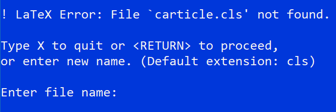

### Errors and Debugging in Latex

Writing in Latex is a pain, specially because the errors are hard to catch (specially the simplest ones). Just to give you a sense, this is a [thread that one experienced programmer](https://tex.stackexchange.com/questions/309010/teach-me-to-debug) started in stackexchange about debugging:

> Ok, 35 years of programming has not prepared me to debug tex errors. It's painful.

So, the basics for reading the errors is displayed in the image below.[^2] First, the type of error is displayed after the `!` symbol. In the image below, the error is "undefined control sequence" (God knows...). At the beginning of the next line, after the `l.` you will see the line number (the Latex line, not the line shown in the Do-File editor). To check out the Latex line, by opening up the `.tex` file. Then, the error is displayed at the end of the line, in the case below is `\toady`, which we can clearly see is about a typo (must be `\today`).

It also worths checking Dickimaw's explanation about [common errors](https://www.dickimaw-books.com/latex/novices/html/commonerrors.html), and [Latex for Complete Novices](https://www.dickimaw-books.com/latex/novices/). The stackexchange thread [teach me to debug](https://tex.stackexchange.com/questions/309010/teach-me-to-debug), and the file [art of problem solving](https://www.tug.org/TUGboat/tb26-1/schwartz.pdf).

Troubleshooting is one of the most time-consuming parts of learning compiling dynamic documents, specially in Latex. The best way to (avoid and) solve troubles is by using text editors. As explained in [Chapter XXX](), the Do-File Editor is very limited compared to others, and it is specially unhelpful for troubleshooting.

The best troubleshooting alternatives are Overleaf, TexStudio. These are specialized text editors in Latex and will provide you the line with the problem and a concrete explanation. They also will automatically flag elementary problems, such as a closing `}` missing or things like that.

Other ways to avoid troubleshooting in both Stata and Latex, is by writing your Do-Files from third party text editors. Recommended Atom and Sublime Texts. Old-School, highly robust alternatives are Vim and Emacs.

### Bugs. Greatest Hits.
The key problem is that the Latex error messages are kind of meaningless for human reading. To help making sense of that, here is our list of Greatest Bug Hits. Memorize all these error messages and you may avoid about 90% of the errors that usually come across when working with Latex.

**Missing a closing curly bracket.** When we forget to close the curling brackeds in a Latex command, we are shown the error message:

> Error message: Paragraph ended before \begin was complete.

**Missing (or wrong) closing an environment.** In this case, we started the [Latex environment](https://www.overleaf.com/learn/latex/Environments) `center` with the command `\begin{center}`. Then, we forgot write `\end{center}` to close the environment `center`. The way to read the error below is: the environment center that was begun at line 6, was ended until `\end{document}` in line 10. This means that because Latex did not find `\end{center}`, it went straigth until finding the next `\end{}` command, which in this case was `\end{document}`; they don't match.

**Missing a Package** TBD.

**Forgetting using the escape command "\" when using special Characters.** If you try to use [special characters](#special) as actual printed characters  and you forget to use the escape character, you will encounter these errors:

**Mispelled or wrong environment** We typed the `graphics` environment, which does not exist.

**Non-existing file** We wrote a `.tex` file that does not exist. This is a common error, often because the name of the file is misspelled and therefore Latex cannot find it.

**Forgot to insert `\end{document}`** Another common mistake, but different than the one shown above about ending environments. When you forget to end the document, the compiler does not even show an error. It stops before running the preamble and body parts of Latex.

**Repeated critical commands (e.g. `\documentclass`)** When you type certain commands twice, you will get a warning but not a fatal error. There are some commands, however, that cannot be repeated. See below. *Note: if you installed one of the newest versions of markdoc you may encounter this problem because markdoc is going to write some Latex code without telling you.*

