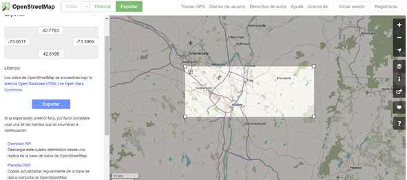
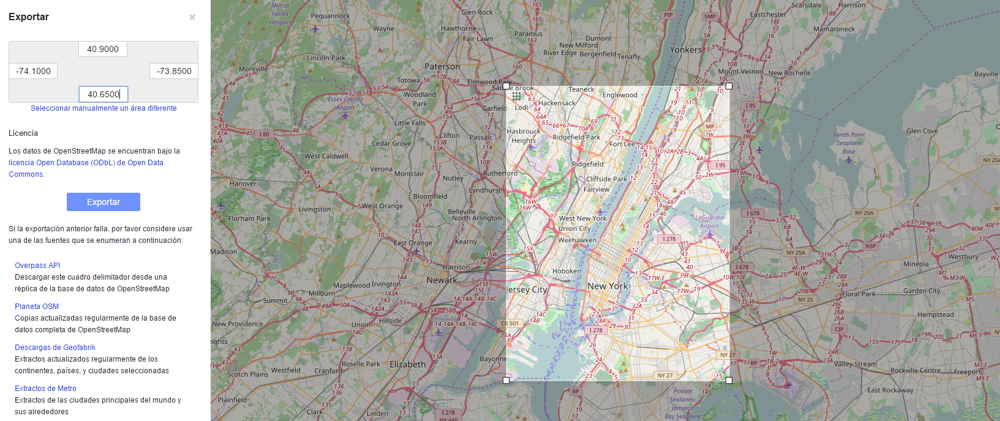
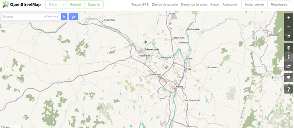
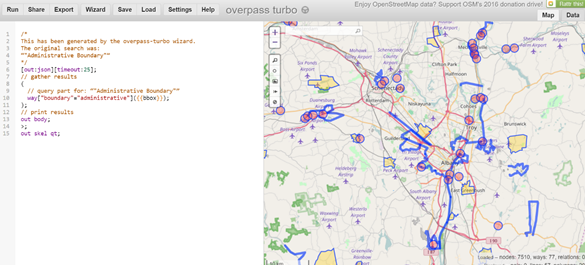
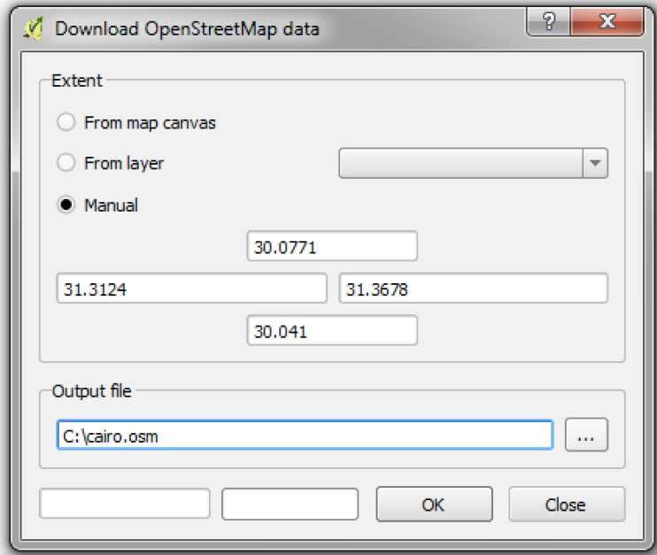

| [Getting Spatial Data](#Getting) |
| [Managing Spatial Data in R](tutorials/managing-data-osm.md) |

In this tutorial, I will intruce several ways to download data from [OpenStreet Maps (OSM)](https://www.e-education.psu.edu/geog585/node/738) into R. OSM is an open platform storing georeferenced data. The data in OSM is produced and managed by the people, and is freely available for visualization, query, download, and modification. OMS is especially useful for data at the city level.

A great feature of OSM maps is the tagging. OSM includes a richer georeferenced dataset for social research than other commercial or governmental maps (for instance, you can find georeferenced items such as biking routes, pharmacy location, tree location, etc.).[^2]

This tutorial is divided in two parts. The [first part](), shows different ways to access data from OSM. The [second part], shows how to manage it into R.

## 1. Getting the Spatial Data  {#Getting}

You can get the OSM data through the OSM’s Application Programming Interface (API) or through third party’s repositories. For the API, you can do it (at least) in four ways (which we will review):

- Manually
- Direct protocol
- Overpass Turbo
- QGIS.

If you need a small map (e.g. a city), the best ways to access the are Manually or through Overpass Turbo. If you need big maps (e.g. one or more countries), I’ll be more efficient to download it from data repositories.

### A. Manually

<u>Step 1.</u> In the site [OpenStreetMap](https://www.openstreetmap.org/), place the map in the region you want to retrieve the information.

<u>Step 2.</u> Click on “Export” on the top left corner. You will access an side menu to edit the bounding box o the map to be retrieved. The bounding box is defined by four numbers in a gray box (see the figure below). These numbers are the coordinates that set the limits of your personalized map. To change the coordinates of the bounding box, click on the option “manually select a different area”.

A shaded box will be displayed in the map. You can edit the coordinates of the bounding box either by inserting the exact coordinates in the left side bar or by dragging the corners in the shaded map.

Once the bounding box is re-defined, click on export to get an `.osm` file, which is the OpenStreetMap native file.

A manual selection will allow you to download a map with a maxium size of 0.25 x 0.25 coordinates. Just as a reference, the figure below is a 0.25 x 0.25 coordinates are from Manhattan.

### B. Direct protocol

Use the endpoint `http://overpass-api.de/api/map?` to perform a query directly from the API. You only need to specify the command `bbox=`, followed by the four coordinates of the bounding in this order: **LEFT**, **DOWN**, **RIGHT**, **UP**.

> http://overpass-api.de/api/map?bbox=-73.9517,42.6198,-73.3969,42.7793

Once you hit this on your browser, the data will be downloaded immediately. This query system is extremely flexible and, with some additional skills, you can filter the data (e.g. retrieve a data set with only highways or administrative boundaries, etc.). With this option you <u>are also limted to download a 0.25 x 0.25 coordinates</u> size map at a time.

## C. Overpass Turbo
[Overpass Turbo](https://overpass-turbo.eu/) is a nice interface to perform more refined queries in the API. In the figure below you will see that the interface is split in two parts. The left part goes for the query, while the right part displays the results of the query in map and data (see the tab “Data” in the upper right corner).

There is a great tool for non-programmers in the *Wizard* option. You can click on the “Wizard” and type what you’re looking for. For instance, in the figure below, I first typed “administrative boundaries”, looking for the boundaries of municipalities, counties, etc. Clicking on the wizard suggestion (“Did you mean: Administrative Boundary”) I ran the Query Wizard again and then I got the query I needed (see the figure below). Once I obtained the programming lines for that query, I clicked *run* to obtain the data.

Something important to have in mind is that OSM uses a different name for points, lines and polygons (the are named nodes, ways, and relations, respectively). For example, in the line 10 in the figure above, you are retrieving a “way” or a lines map. Since administrative boundaries are polygons, you might want to correct “way” for “relation” and click Run again to get the polygons.

Also, notice the gray box in the bottom right corner of the map; it shows the number of nodes, ways and relations that are within the map retrieved.

Once you are satisfied with the query, click on **Export** to get the data. You can export the data in several file formats: `GeoJSON`, `GPX`, `KML`, and `json`. Any of these files can be easily managed in R.

All these files are manageable in R, but I personally fond GeoJSON the easiest to import into R.

A last advice, downloading through Overpass Turbo can be very slow.
Sometimes the website crashes when trying to process the query. Be patient; if crashes, try multiple times, it will work out eventually.

To save the code used for the query, click `Export-> Query -> as text`.

## D. QGIS Interface

Although overpass Turbo offers an enhanced experience, compared with the previous options, it still has some difficulties with big OSM maps (either by map size or by density of information). QGIS is a great alternative for retrieving big maps. QGIS is an open source software for GIS; among its may features QGIS can interact with OSM's API. To do so, the steps to follow are:

<u>Step 1.</u> Once you opened QGIS, click on `Vector -> OpenStreetMap -> Download data`. Select `manual` and then type the coordinates of the bounding box from the map you want to retrieve. Then select a name and location for the output file (it will be an `.osm` file format).

<u>Step 2.</u> After downloading the `.osm` file, click on `Vector -> OpenStreetMap -> Import Topology from XML`. In `Input XML file` place the `.osm` file dowloaded. QGIS automatically will suggest you an output file name and location. Check the box `Create connection` and then click `OK` (keep the connection name suggested). This process will create a SpatialLite database file `.osm.db` and a SpatialLite file.

<u>Step 3.</u> Once you created the SpatialLite files, click on `Vector -> OpenStreetMap -> "Export Topology to Spatial Lite"`. In the first field, insert the SpatialLite database (`.osm.db`) you just have created in Step 2. The `.osm` file stores all the layers for points, lines and polygons, but you cannot export all these together into QGIS. You must export one by one. Therefore, in `Export type`, select the type of layer you want: points, lines or polygons. For example, if you are interested in highways, you will find this attribute in the layer lines.

Then, select an file name for the layer to be exported and click on `Load from DB`. When you click here, you will see all the attributes available for either points, lines or polygons. Click on all the attributes you want to keep in your map and click `OK`. The file will be exported as a `SpatialLite` file, but you can easily save it as `Shapefile`, `GeoJSON`, `KML` or other GIS file format.

## E. Repositories

All the options before are for small to medium maps. If you need to use regional maps (at national or international level), then you should get the data from repositories. There are many repositories and is easy to download the data.

The first place you may want to visit is [BBBike.org](http://extract.bbbike.org/). This is an interface similar than Overpass Turbo that allows you to get personalized data with bigger dimensions. BBBike allows you to download the file directly as ESRI’s Shapefile. Another great site is [Geofabrik](https://www.geofabrik.de). Here you can find GIS files (`Shapefiles` and `.osm`) at different levels, from continents to states.

Here is a [complete list of OpenStreetMap repositories](http://wiki.openstreetmap.org/wiki/Planet.osm).

[^2]: See the [full catalog of features](http://wiki.openstreetmap.org/wiki/Map_Features).
